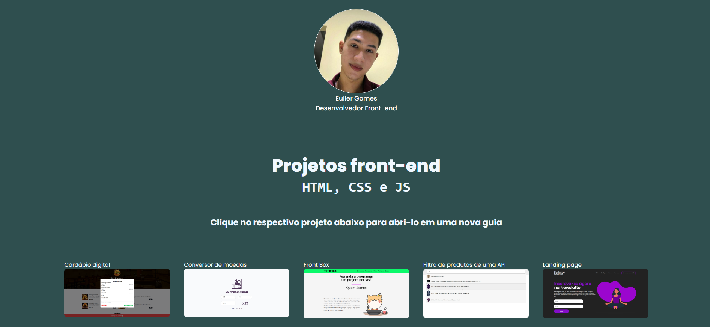

# Projetos front-end | HTML, CSS e JS

Este repositório contém um site de projetos front-end realizados apenas com HTML, CSS e Javascript ao longo do meu início de carreira.

## ⚙️ Como acessar

Para ver o resultado de cada projeto, basta acessar o link abaixo para abri-lo em seu navegador:

[Link do projeto](https://eullergomes.github.io/frontend-challenges/)